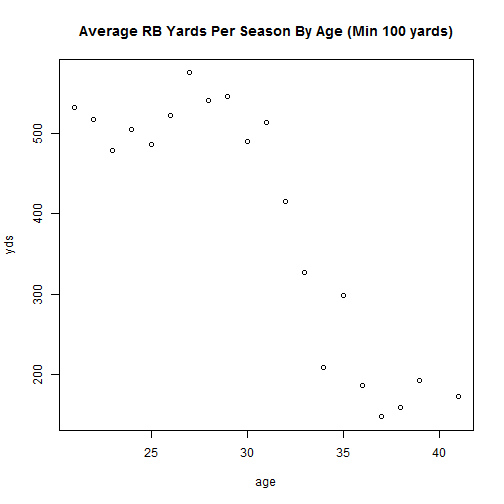
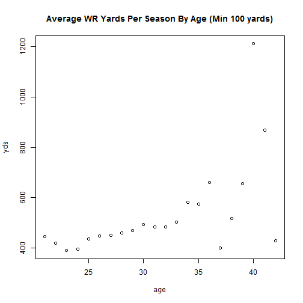
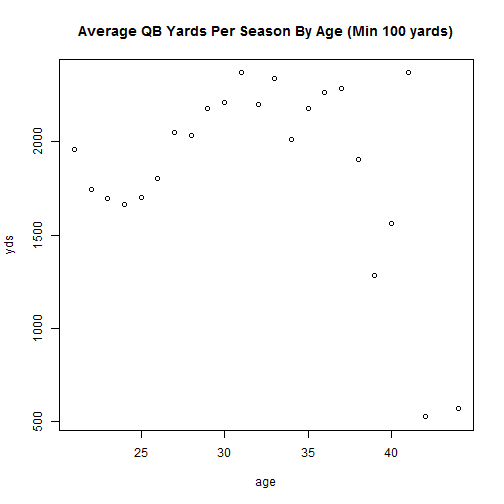

Investigate how age affects performance.

### Running Backs


```r
library(plyr)
PLAYER = data.frame(read.csv("C:/Users/karl/Documents/Fantasy-Football/data/nfl_00-15/csv//PLAYER.csv"))
PRB = data.frame(read.csv("C:/Users/karl/Documents/Fantasy-Football/data/tidy/full/PRB.csv"))
a = PRB[ PRB$wk <= 17, c("player", "seas", "gid", "yds") ]

b = ddply(a, .(player, seas), summarize, yds = sum(yds), games = length(unique(gid) )) 
b = join( b, PLAYER[,c("player", "yob")], by="player")
b$age = b$seas - b$yob

x = ddply( b[b$yds>100,], .(age), summarize, yds = mean(yds))
plot(x)
title(main="Average RB Yards Per Season By Age (Min 100 yards)")
```

 

### Wide Receivers

This one seems fishy.  Needs more investigation.

 

### Quarterbacks

 


