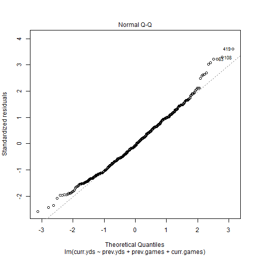
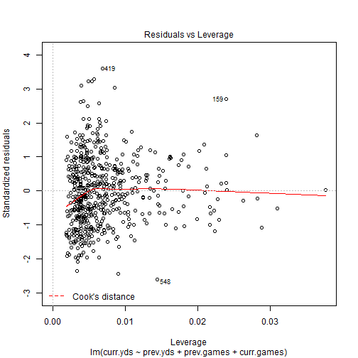

In this document we shall try to predict how many yards a running back will run over the course of an entire season.  We shall use the players' previous season total yards amount as the primary independent variable, and the current year total yards as the dependent variable.  We shall also consider the number of games played as independent variables for our model as we progress.

### Running Backs


```r
library(plyr)

PRB = data.frame(read.csv("C:/Users/karl/Documents/Fantasy-Football/data/tidy/full/PRB.csv"))

a = PRB[ PRB$wk <= 17, ]
a = ddply(a, .(player,seas), summarize, yds = sum(yds, na.rm=TRUE), tds = sum(td, na.rm=TRUE), games = length(unique(gid)) )
a$avg.yds = a$yds / a$games

# 'a' shows yearly yards and td amounts per player per season.  We also have an average yards per game.
print(head(a))
```

```
##    player seas yds tds games avg.yds
## 1 AA-0025 2015 598   2    16   37.38
## 2 AA-0600 2000  -2   0     1   -2.00
## 3 AA-0800 2011   8   0     1    8.00
## 4 AA-0800 2012  61   1     4   15.25
## 5 AA-0900 2011  48   0     2   24.00
## 6 AA-0900 2012 124   1     9   13.78
```

```r
b = data.frame( player=factor() )

for (s in 2001:2015) {
  
  a1 = a[ a$seas == (s-1) & a$yds > 500, c("player", "yds", "tds", "games", "avg.yds") ]
  a2 = a[ a$seas == s, c("player", "yds", "tds", "games", "avg.yds") ]  
  
  names(a1)[2] = "prev.yds"
  names(a1)[3] = "prev.tds"
  names(a1)[4] = "prev.games"
  names(a1)[5] = "prev.avg.yds"  
  names(a2)[2] = "curr.yds"
  names(a2)[3] = "curr.tds"
  names(a2)[4] = "curr.games"
  names(a2)[5] = "curr.avg.yds"  
  
  bx = join( a1, a2, by="player", type="inner")
  bx$seas = s  
  b = rbind( b, bx)
}

# 'b' gives us a juxtaposition of the previous yards/tds and currnet yards/tds for each player by season
print(head(b))
```

```
##    player prev.yds prev.tds prev.games prev.avg.yds curr.yds curr.tds
## 1 AG-1600     1175       10         16        73.44     1387        9
## 2 CD-1500     1435        7         16        89.69     1315       10
## 3 CG-0400     1142        7         16        71.38      839        1
## 4 CM-0600     1156        9         16        72.25     1502       10
## 5 DM-2200      632        6         16        39.50      484        2
## 6 EG-0200     1505       14         16        94.06      939        5
##   curr.games curr.avg.yds seas
## 1         16        86.69 2001
## 2         16        82.19 2001
## 3         16        52.44 2001
## 4         16        93.88 2001
## 5         15        32.27 2001
## 6         16        58.69 2001
```

Now that we have our data ready for analysis, we shall apply some linear models.  Also, here are a few refresher links for your convenience:
- [Understanding lm() Output from Montana State University](http://www.montana.edu/screel/Webpages/conservation%20biology/Interpreting%20Regression%20Coefficients.html#/4)
- [Linear Models from Princeton University](http://data.princeton.edu/R/linearModels.html)


```r
# 1st attempt: linear model simply uses previous yards total to predict current yards total

c1 = lm( formula = curr.yds ~ prev.yds, data = b )
c1.percent = round(summary(c1)$r.squared * 100, digits=2)
print(paste(c1.percent, "% of variance explained by model.", sep=""))
```

```
## [1] "22.71% of variance explained by model."
```

```r
# 2nd attempt: predict average yards per game played instead of total yards (hopefully reduce impact of injuries)

c2 = lm( formula = curr.avg.yds ~ prev.avg.yds, data = b )
c2.percent = round(summary(c2)$r.squared * 100, digits=2)
print(paste(c2.percent, "% of variance explained by model.", sep=""))
```

```
## [1] "32.9% of variance explained by model."
```

```r
# 3rd attempt: given know prev total yards, prev games played, number of current games played, predict current yards

c3.rb = lm( formula = curr.yds ~ prev.yds + prev.games + curr.games, data = b)
c3.rb.percent = round(summary(c3.rb)$r.squared * 100, digits=2)
print(paste(c3.rb.percent, "% of variance explained by model.", sep=""))
```

```
## [1] "63.17% of variance explained by model."
```

### Wide Recievers


```
## [1] "c1: 25.98% of variance explained by model."
```

```
## [1] "c2: 35.8% of variance explained by model."
```

```
## [1] "c3: 61.24% of variance explained by model."
```

### Quarterbacks


```
## [1] "c1: 35.17% of variance explained by model."
```

```
## [1] "c2: 31.5% of variance explained by model."
```

```
## [1] "c3: 93.43% of variance explained by model."
```

### What do the Results Means?

The third linear model (c3) was far more effective, however it has an unfair advantage because it knows how many
games the player will participate in during the current year. Predicting the number of games that a player will participate in
will be modeled separately, mainly by predicting injuries.  
What follows below is a more detailed inspection of the linear model that was used to predict RB performance.


```r
print(summary(c3.rb))
```

```
## 
## Call:
## lm(formula = curr.yds ~ prev.yds + prev.games + curr.games, data = b)
## 
## Residuals:
##    Min     1Q Median     3Q    Max 
## -716.5 -192.5  -22.1  180.5  998.1 
## 
## Coefficients:
##              Estimate Std. Error t value Pr(>|t|)    
## (Intercept) -249.2573    91.3580   -2.73   0.0066 ** 
## prev.yds       0.6169     0.0384   16.08   <2e-16 ***
## prev.games   -36.9065     6.5686   -5.62    3e-08 ***
## curr.games    74.5427     3.0148   24.73   <2e-16 ***
## ---
## Signif. codes:  0 '***' 0.001 '**' 0.01 '*' 0.05 '.' 0.1 ' ' 1
## 
## Residual standard error: 278 on 569 degrees of freedom
## Multiple R-squared:  0.632,	Adjusted R-squared:  0.63 
## F-statistic:  325 on 3 and 569 DF,  p-value: <2e-16
```

```r
plot(c3.rb)
```

    


